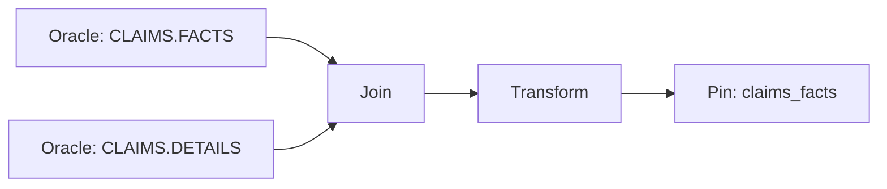

# Claims ETL
---
title: Providers ETL Pipeline
author: "Jane Doe"
publisher: "DART Analytics"
---

**Owner**: Data Engineering — DART  
**Schedule**: Hourly  
**SLA**: 30 min E2E

## Purpose

Deliver **claims** facts with service/paid dates, revenue codes, and denials.

## Inputs

- Oracle: `CLAIMS.FACTS`
- Oracle: `CLAIMS.DETAILS`

<div class="grid cols-3" markdown>
<div class="card">
**Providers** <span class="chip ok">OK</span><br/>
Schedule: 02:00 &nbsp;·&nbsp; SLA: **15m**
</div>
<div class="card">
**Members** <span class="chip">Normal</span><br/>
Schedule: 03:00 &nbsp;·&nbsp; SLA: **20m**
</div>
<div class="card">
**Claims** <span class="chip warn">Delay</span><br/>
Schedule: Hourly &nbsp;·&nbsp; SLA: **30m**
</div>
</div>

## Parameters

| Name           | Type      |      Default      | Description                 |
| :------------- | :-------- | :---------------: | :-------------------------- |
| `since`        | timestamp |      `null`       | Incremental start timestamp |
| `max_workers`  | integer   |        `6`        | Parallelism                 |
| `partition_by` | list[str] | `[service_month]` | Output partitioning         |

## Transform Rules

1. Filter by **since**
2. Join details → facts
3. Validate currency + dates
4. Derive **admit_month**, **service_month**

## Output

- **Pin**: `claims_facts` (Parquet partitioned by month)
- **Schema**: `v2.3`

## Lineage



## Run

```bash
python -m etl_example.jobs.claims --since "2025-11-01T00:00:00" --partition-by service_month
```
