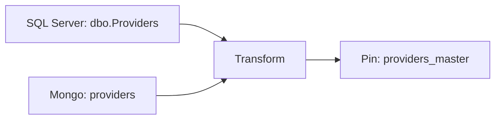

# Providers ETL

**Owner**: Data Engineering — DART  
**Schedule**: Daily @ 02:00 PT  
**SLA**: 15 min E2E

## Purpose

Produce a de-duplicated, normalized **provider master** dataset for downstream analytics and rosters.

## Inputs

- SQL Server: `dbo.Providers` (columns: `npi`, `name`, `address`, `taxonomy`, `updated_at`)
- MongoDB: `providers` (keys: `_id`, `npi`, `alt_names`, `addresses`)

## Parameters

| Name          | Type      | Default  | Description                     |
| :------------ | :-------- | :------: | :------------------------------ |
| `since`       | timestamp |  `null`  | Incremental start timestamp     |
| `max_workers` | integer   |   `8`    | Parallel workers for extraction |
| `chunk_rows`  | integer   | `100000` | Row batch size per worker       |

---

| Method   | Description                          |
| -------- | ------------------------------------ |
| `GET`    | :material-check: Fetch resource      |
| `PUT`    | :material-check-all: Update resource |
| `DELETE` | :material-close: Delete resource     |

---

| Job       | Schedule | SLA (min) | Status                               |
| :-------- | :------: | --------: | ------------------------------------ |
| Providers |  02:00   |        15 | <span class="chip ok">OK</span>      |
| Members   |  03:00   |        20 | <span class="chip">Normal</span>     |
| Claims    |  Hourly  |        30 | <span class="chip warn">Delay</span> |
</div>

## Transform Rules

1. Deduplicate by **NPI**
2. Normalize names and addresses (Smarty API)
3. Standardize taxonomy codes (crosswalk v2025.1)
4. Validate schema + null handling

## Output

- **Pin**: `providers_master` (Parquet)
- **Schema**: `v1.2`
- **Metadata**: `{owner: DART, pii: "masked", source: "SQL, Mongo"}`

## Lineage



## Run

```bash
python -m etl_example.jobs.providers --since "2025-11-01T00:00:00" --max-workers 8
```
