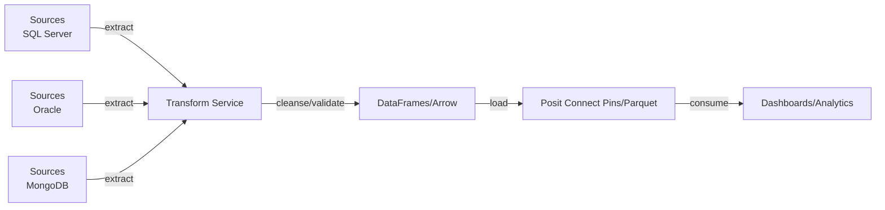

# Architecture

```mermaid
flowchart LR
    A[Sources\nSQL Server] -->|extract| T[Transform Service]
    B[Sources\nOracle] -->|extract| T
    C[Sources\nMongoDB] -->|extract| T
    T -->|cleanse/validate| D[DataFrames/Arrow]
    D -->|load| P[Posit Connect Pins/Parquet]
    P -->|consume| BI[Dashboards/Analytics]
```
