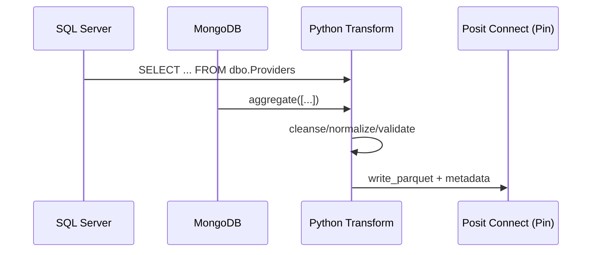

# Lineage

```mermaid
sequenceDiagram
    participant SQL as SQL Server
    participant M as MongoDB
    participant Py as Python Transform
    participant Pin as Posit Connect (Pin)
    SQL->>Py: SELECT ... FROM dbo.Providers
    M->>Py: aggregate([...])
    Py->>Py: cleanse/normalize/validate
    Py->>Pin: write_parquet + metadata
```
