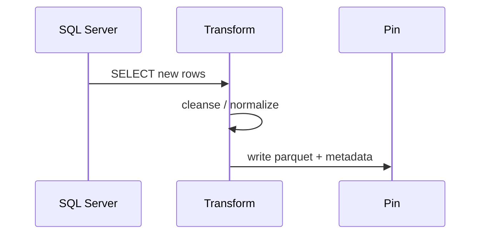

# Dashboards

## KPI Row

:material-check-decagram: **99.95%** uptime

:material-timer-sand: **P95 12m** completion

:material-database: **3** source systems

:material-chart-timeline: **12** pipelines

## Pipeline Status

- :material-database: **Providers**
  Status: ✅ **OK** · Duration **12m**  
  [Runbook](../../operations/runbook.md){ .md-button }
- :material-account-multiple: **Members**
  Status: ✅ **OK** · Duration **18m**  
  [Runbook](../../operations/runbook.md){ .md-button }
- :material-file-document: **Claims**
  Status: ⚠️ **Delayed** · Duration **31m**  
  [Investigate](../../operations/troubleshooting.md){ .md-button .md-button--primary }

## Lineage Snapshot

