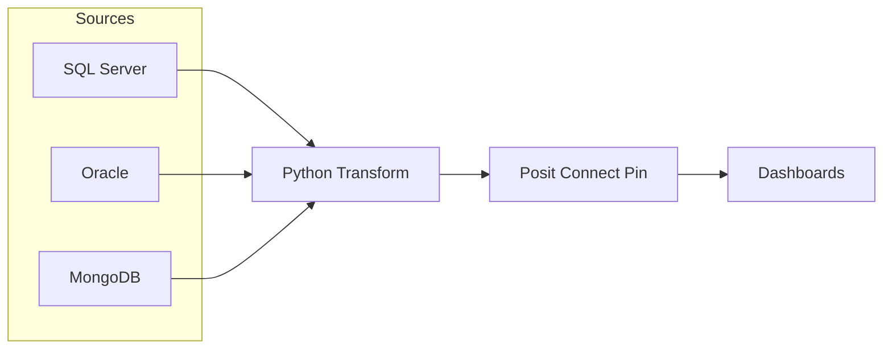

# Layouts & Grids

## Responsive columns

### Extract
- SQL Server
- Oracle
- MongoDB

### Transform
- Python
- Pandas / PyArrow
- Dask

### Load
- Posit Connect Pins
- Parquet
- Snowflake (future)

## Cards with badges

**Providers** daily Owner: DART · SLA: **15m**

**Members** daily Owner: DART · SLA: **20m**

**Claims** hourly Owner: DART · SLA: **30m**

## KPIs

:material-check-circle 99.9% Success

:material-timer-sand P95 14m SLA

:material-alert 2 Incidents

## KPIs

  
:material-check-circle: 99.9% Success

  
:material-timer-sand: P95 14m SLA

  
:material-alert: 2 Incidents

## KPIs

- :material-check-circle:  
  **99.9%**  
  Success

- :material-timer-sand:  
  **P95 14m**  
  SLA

- :material-alert:  
  **2**  
  Incidents

## KPIs

- :material-check-circle: **99.9%**  
  Success

- :material-timer-sand: **P95 14m**  
  SLA

- :material-alert: **2**  
  Incidents

## KPIs

  
:material-check-circle: 99.9% Success

  
:material-timer-sand: P95 14m SLA

  
:material-alert: 2 Incidents

:material-check-decagram: **99.95%** uptime

:material-timer-sand: **P95 12m** completion

:material-database: **3** source systems

:material-chart-timeline: **12** pipelines

## Mermaid

  

    

      
Data Quality Gate

    

    Author: Geovany Guifarro
  

---
title: Claims Extract
author: Geovany Guifarro
publisher: DART — CA Market Data Analytics & Reporting
---
