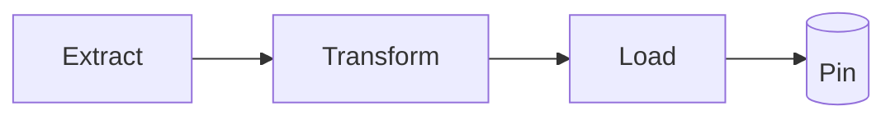

# UI Components

This page demonstrates the **Modern Card UI** partial and three table patterns that won’t conflict with one another.

## New UI Table

  <table class="datatable" data-per-page="10">
    <thead class="table-head">
      <tr><th>Team</th><th>Region</th><th>SLA</th><th>Owner</th></tr>
    </thead>
    <tbody>
      <tr><td>DART</td><td>CA</td><td>99.9</td><td>Ana</td></tr>
      <tr><td>Claims</td><td>AZ</td><td>98.7</td><td>Ben</td></tr>
      <tr><td>Members</td><td>CA</td><td>96.2</td><td>Cara</td></tr>
      <tr><td>Analytics</td><td>CA</td><td>99.5</td><td>Dan</td></tr>
    </tbody>
  </table>

## bootstrap style

  <table class="datatable" data-per-page="10">
    <thead>
      <tr><th>Package</th><th>Language</th><th>Stars</th></tr>
    </thead>
    <tbody>
      <tr><td>MkDocs Material</td><td>Python</td><td>16,000</td></tr>
      <tr><td>Grid.js</td><td>JavaScript</td><td>7,000</td></tr>
      <tr><td>Simple‑DataTables</td><td>JavaScript</td><td>5,000</td></tr>
    </tbody>
  </table>

## bootstrap grid.js

  <table class="gridify">
    <thead>
      <tr><th>Team</th><th>Region</th><th>SLA</th></tr>
    </thead>
    <tbody>
      <tr><td>DART</td><td>CA</td><td>99.9</td></tr>
      <tr><td>Claims</td><td>AZ</td><td>98.7</td></tr>
      <tr><td>Members</td><td>CA</td><td>96.2</td></tr>
    </tbody>
  </table>

## Cards

Include the HTML partial (provided in `docs/_includes/ui-cards.html`):

--8<-- "ui-cards.html"

> Tip: Use the **Density** button to preview compact spacing.

  

    <article class="card">
      

      

        <h2 class="title">Style Check</h2>
        
If this looks plain, card.css isn’t loading.

      

      
$0

    </article>
  

---

## Tables — pick your enhancement

### 1) Classless Markdown table → _Tablesort_ (click headers)

Plain Markdown (no classes) automatically gets sortable headers via `tablesort.js`.

| Name              | Language   | Stars |
| ----------------- | ---------- | ----: |
| MkDocs Material   | Python     | 16000 |
| Grid.js           | JavaScript |  7000 |
| Simple-DataTables | JavaScript |  5000 |

### 2) `.datatable` → _Simple-DataTables_ (search, paginate, export)

Use an HTML table and apply the `datatable` class. You can tweak `data-per-page` and `data-per-page-select`.

<table
  class="datatable js-filters"
  data-per-page="5"
  data-per-page-select="[5,10,25,50,100]"
>
  <thead>
    <tr>
      <th>Package</th>
      <th>Language</th>
      <th>Category</th>
      <th>Stars</th>
    </tr>
  </thead>
  <tbody>
    <tr>
      <td>MkDocs Material</td>
      <td>Python</td>
      <td>Docs</td>
      <td>16000</td>
    </tr>
    <tr>
      <td>Grid.js</td>
      <td>JavaScript</td>
      <td>Tables</td>
      <td>7000</td>
    </tr>
    <tr>
      <td>Simple-DataTables</td>
      <td>JavaScript</td>
      <td>Tables</td>
      <td>5000</td>
    </tr>
    <tr>
      <td>Pandas</td>
      <td>Python</td>
      <td>Data</td>
      <td>42000</td>
    </tr>
    <tr>
      <td>Polars</td>
      <td>Rust/Python</td>
      <td>Data</td>
      <td>20000</td>
    </tr>
  </tbody>
</table>

> The `js-filters` class adds a filter row beneath the headers (from `table-tools.js`).

### 3) `.gridify` → _Grid.js_ (search, paginate, resizable columns)

Provide a `<table class="gridify">` with a single header row and body rows. It will be replaced by a Grid.js widget.

<table class="gridify">
  <thead>
    <tr>
      <th>Team</th>
      <th>Region</th>
      <th>SLA</th>
    </tr>
  </thead>
  <tbody>
    <tr>
      <td>DART</td>
      <td>California</td>
      <td>99.9%</td>
    </tr>
    <tr>
      <td>Analytics</td>
      <td>National</td>
      <td>99.5%</td>
    </tr>
    <tr>
      <td>Data Eng</td>
      <td>Remote</td>
      <td>99.7%</td>
    </tr>
  </tbody>
</table>

> Don’t mix `.datatable` and `.gridify` on the same table.

---

## Mermaid (theme-aware)

Mermaid picks a **neutral** theme on light and **dark** on slate, via `mermaid-init.js`.

---

## Notes

- Light/dark palette is controlled by Material. Mermaid re-initializes on palette toggle.
- Card UI styles are namespaced under `.ui-cards` to avoid clashing with your theme.
- For big tables, choose **one** enhancement per table (Simple-DataTables _or_ Grid.js).

<!-- Example HTML for new table design -->

  <table class="datatable js-filters" data-per-page="5">
    <thead class="table-head">
      <tr>
        <th>Service</th>
        <th>Region</th>
        <th>Uptime</th>
        <th>Status</th>
      </tr>
    </thead>
    <tbody>
      <tr>
        <td>Claims ETL</td>
        <td>California</td>
        <td>99.92%</td>
        <td>OK</td>
      </tr>
      <tr>
        <td>Provider Sync</td>
        <td>National</td>
        <td>99.78%</td>
        <td>Warn</td>
      </tr>
      <tr>
        <td>Member Load</td>
        <td>California</td>
        <td>98.67%</td>
        <td>Bad</td>
      </tr>
      <tr>
        <td>Eligibility</td>
        <td>Arizona</td>
        <td>99.88%</td>
        <td>OK</td>
      </tr>
      <tr>
        <td>Capitation</td>
        <td>California</td>
        <td>99.96%</td>
        <td>OK</td>
      </tr>
    </tbody>
  </table>

 

  <table class="gridify">
    <thead class="table-head">
      <tr>
        <th>Team</th>
        <th>Dataset</th>
        <th>Records</th>
        <th>Latency</th>
      </tr>
    </thead>
    <tbody>
      <tr>
        <td>DART</td>
        <td>Providers</td>
        <td>12M</td>
        <td>1.2s</td>
      </tr>
      <tr>
        <td>Analytics</td>
        <td>Claims</td>
        <td>8M</td>
        <td>0.9s</td>
      </tr>
      <tr>
        <td>Members</td>
        <td>Eligibility</td>
        <td>6M</td>
        <td>1.5s</td>
      </tr>
      <tr>
        <td>Finance</td>
        <td>Capitation</td>
        <td>2M</td>
        <td>0.7s</td>
      </tr>
    </tbody>
  </table>

